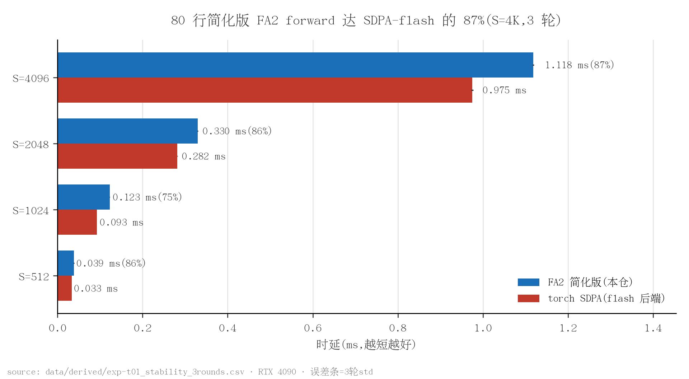
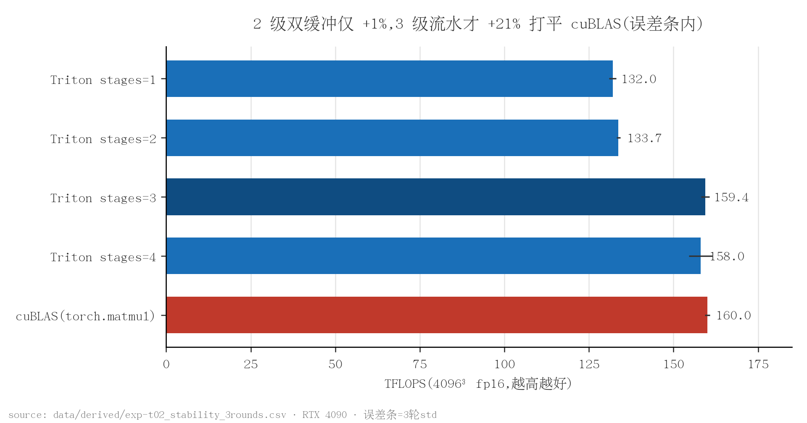
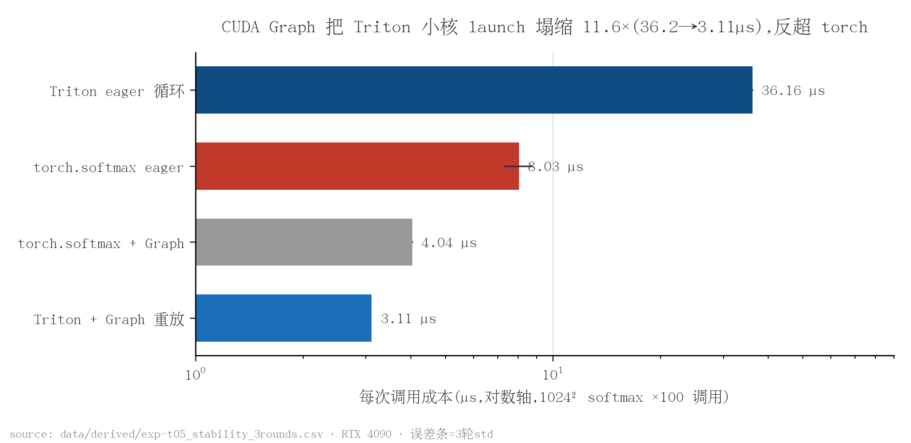
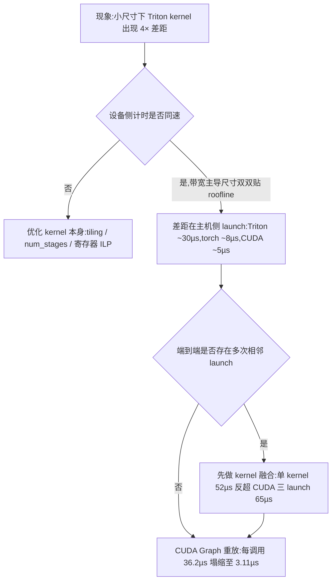

# triton-kernels — Triton 手写 LLM 算子:FA2 / 流水线 GEMM / FP8 / flash-decoding / MoE / CUDA Graph

本项目在 RTX 4090 上从零实现并系统 benchmark 一组 LLM 推理核心算子，回答一个问题：简化实现能在多大程度上逼近生产级库（SDPA-flash、cuBLAS），差距又具体来自哪一层。每个快慢结论都拆到设备侧、launch、融合三个口径分别给出数字，且每个数字可溯源到落盘的原始数据。产出算子已被自研推理引擎 [llm-engine](https://github.com/lyell0710/llm-engine) 作为依赖接入（attention/linear/decode 路径）。

## 性能结果

测量平台 RTX 4090；除注明外均为 3 轮 mean±std。

| 结果 | 数字 | 测量条件 | 证据 |
|---|---|---|---|
| FA2 forward,80 行简化版 | SDPA-flash 的 **87%**(S=4K:1.118±0.002 vs 0.975±0.002 ms,123 TFLOPS) | 简化版、仅 forward、4K 形状（B1·H32/8·D128）、对照=SDPA flash 后端 | EXP-T01 · `data/derived/exp-t01_stability_3rounds.csv` |
| 流水线 GEMM 打平 cuBLAS | 4096³ fp16:**160.5 TFLOPS** vs 159.8（stages=3;3 轮复现 159.4±1.2 vs 160.0±0.7）;8B up_proj 反超 4.8% | 限两测形状 fp16;cuBLAS=torch.matmul dispatch(cuBLASLt) | EXP-T02 · `data/derived/exp-t02_stability_3rounds.csv` |
| FP8 per-block GEMM | 228.1±1.3 TFLOPS = **1.5×** fp16 cuBLAS（DeepGEMM 缩放策略在 Ada mma 落地） | 预量化孤立 GEMM，非端到端（在线量化端到端 72.9，量化 kernel 是瓶颈） | EXP-T06 · `data/derived/exp-t06_stability_3rounds.csv` |
| flash-decoding(split-K) | 32K 上下文 **2.24±0.11×** vs naive（repeat 预置口径；含 repeat 实体化成本 **5.17×**） | 3 轮；Skv<=8K 时 0.86-0.88×（归并开销反亏，长上下文武器）；引擎 fp32 probe PASS | EXP-T04 · `data/derived/exp-t04_stability_3rounds.csv` |
| MoE unpermute | **12.5×** vs torch（1.053±0.002 至 0.0845±0.0001 ms）,gather 式无原子 | 单卡 permute/unpermute,T4096/D2048/E60/top4 | EXP-T07 · `data/derived/exp-t07_stability_3rounds.csv` |
| CUDA Graph 消 launch | 每调用 36.2±0.1 至 3.11 µs，**11.6×** 塌缩，graph 后 Triton 反超 torch | 1024² softmax ×100 调用；地址稳定前提（动态 shape 需分桶） | EXP-T05 · `data/derived/exp-t05_stability_3rounds.csv` |



*图 1：简化版 FA2 forward 随序列长逼近 SDPA-flash，S=4K 达 87%（形状 B1·H32/8·D128，fp16）。（数据：`data/derived/exp-t01_stability_3rounds.csv`；脚本：`scripts/plot_readme_figures.py`）*



*图 2：同一 kernel 只变 num_stages，2 级双缓冲仅 +1%，3 级流水才 +21%，与 cuBLAS(torch.matmul dispatch)打平在误差条内。（数据：`data/derived/exp-t02_stability_3rounds.csv`；脚本：`scripts/plot_readme_figures.py`）*



*图 3：小 kernel 场景的正解是上 CUDA Graph 而不是换 CUDA，graph 重放把每调用 36.2µs 塌缩到 3.11µs，反超 torch eager 与 torch+graph（对数轴）。（数据：`data/derived/exp-t05_stability_3rounds.csv`；脚本：`scripts/plot_readme_figures.py`）*

## 关键发现

**"Triton 比 CUDA 慢"是个没有意义的裸命题——必须拆三个口径。** 同一行核（softmax）在带宽主导尺寸下 Triton 与 torch 同速（8192²:917 vs 921 GB/s，双双贴 4090 roofline 91%）；小尺寸看到的 4× "差距"全部来自主机侧 launch（Triton Python 分发 ~30µs > torch C++ ~8µs > 裸 CUDA ~5µs）；而端到端还有第三层反转：Triton 单 kernel 融合（52µs）反超"更快的 CUDA kernel + 3 次前置 launch"(65µs)——融合数比单核快慢更重要。launch 这一层的终局解是 CUDA Graph：重放把每调用 36.2µs 塌缩到 3.11µs，此后 Triton 反超 torch eager（EXP-T03《三件套移植 + torch 绑定》/T05）。



**流水线深度必须按"搬运延迟/计算时长"比值配，双缓冲不是自动奖励。** 同一 GEMM kernel 只变 num_stages：2 级（经典双缓冲）仅 +1%，3 级才 +21% 并打平 cuBLAS——Ada 上一次 BLOCK_K 搬运的延迟长于一轮 tensor core dot，2 级流水藏不住它，必须再加一级（EXP-T02《流水线 GEMM》）。另一个反直觉数字：该 GEMM occupancy 只有 17%（寄存器限制）却打出 98% 峰值算力——tensor core kernel 靠寄存器堆 ILP 藏延迟，比高 occupancy 更值钱，"occupancy 低"只在延迟藏不住时才是嫌疑人。

**FP8 的 2× 理论收益在 Ada 上只能吃到 1.5×，缺口是指令世代的架构税。** DeepGEMM 的细粒度缩放代数（权重 128×128 块 scale + 激活 per-token-group scale）可以原样搬到 sm_89，但 Hopper 的 wgmma 有原生 scale 槽、TMA 管搬运，Ada 只有同步 mma + cp.async，缩放乘法只能在累加器侧手乘、fp32 累加占算力，fp8 mma 峰值本身也打折。另一半真相：1.5× 是预量化孤立 GEMM 的数字，在线量化端到端只有 72.9 TFLOPS——量化 kernel 才是瓶颈，这正是真实 serving 里权重预量化、激活量化融合进上游算子的原因（EXP-T06《FP8 GEMM》）。

**MoE unpermute 的 12.5× 来自把 scatter-add 翻转成 gather。** 直觉实现是每个专家输出行原子加回原 token 位；改成每个 token 自己去收 topk 行加权求和，则无竞争、求和顺序确定（数值可复现）。测量还给出一个结构性发现：索引构建（argsort，0.27ms）比数据搬运本体更贵——这就是 vLLM 为它写专用 kernel(moe_align_block_size)的存在理由（EXP-T07《MoE Permute/Unpermute》）。

## 代码结构

```
src/          fa2_fwd / gemm_pipelined / fp8_gemm / flash_decode / moe_permute
              / elementwise_kernels + torch_ext/(CUDA kernel 绑定)
scripts/      test_*(正确性 gate + bench)、plot_readme_figures、kperf(无计数器观测)
records/      EXP-T01~T07 实验记录(假设先于实验锁定,含排障与修正全过程)
data/         raw/EXP-T*(不可变原始数据,含 3 轮复测)+ derived/(聚合 mean/std)
figures/      全部脚本生成(本 README 三图)
docs/theory/  01 FlashAttention / 02 双缓冲 / 03 Triton vs CUDA 四口径 / 04 无 NCU 观测
              / 05 flash-decoding / 06 FP8@Ada(mma vs wgmma/TMA 界线)/ 07 MoE dispatch-combine
docs/lectures/ 深度讲义:01 softmax→FA2→flash-decoding / 02 GEMM 流水线与 FP8
              / 03 launch·融合·CUDA Graph(八段结构:原理→逐段走读→数据口径→追问)
docs/talk/    面试讲稿   docs/archive/  被取代文档(superseded 标注)
```

**在线 softmax 主循环**（`src/fa2_fwd.py`，完整 kernel ~80 行）——FA2 快的本质是不物化 S×S 注意力矩阵，用 m/l 两个跑动统计量边算边校正：

```python
# online softmax 的三个跑动量:行最大值 m、行和 l、输出累加 acc(全 fp32)
m_i = tl.full([BLOCK_M], float("-inf"), dtype=tl.float32)
l_i = tl.zeros([BLOCK_M], dtype=tl.float32)
acc = tl.zeros([BLOCK_M, HEAD_DIM], dtype=tl.float32)

for start_n in range(0, hi, BLOCK_N):   # K/V 分块流过片上,HBM 读写 O(S·D)
    ...                                 # load k/v;qk = q·kᵀ·scale + causal mask
    # online 更新:新块并入后,旧的 exp 统一乘 alpha 校正到新基准 m_new
    m_new = tl.maximum(m_i, tl.max(qk, 1))
    alpha = tl.exp(m_i - m_new)         # 旧统计量的指数校正因子
    p = tl.exp(qk - m_new[:, None])
    l_i = l_i * alpha + tl.sum(p, 1)
    acc = acc * alpha[:, None] + tl.dot(p.to(v.dtype), v)
    m_i = m_new

acc = acc / l_i[:, None]                # 归一化推迟到循环外,全程无 S×S 物化
```

**流水线 GEMM**(`src/gemm_pipelined.py`)——CUDA 手写双缓冲（两块 shared memory + cp.async 交替）在 Triton 里是同一循环体加一个编译器旋钮，本项目把"双缓冲带来多少"变成可测数字（见图 2）：

```python
acc = tl.zeros((BLOCK_M, BLOCK_N), dtype=tl.float32)
for k0 in range(0, K, BLOCK_K):
    a = tl.load(a_ptrs, mask=..., other=0.0)  # num_stages=N 让编译器把 load
    b = tl.load(b_ptrs, mask=..., other=0.0)  # 与 dot 软件流水化:N=1 无重叠,
    acc = tl.dot(a, b, acc)                   # N=2 即双缓冲,N>=3 更深流水,
    a_ptrs += BLOCK_K * stride_ak             # shared memory 占用与 N 成正比
    b_ptrs += BLOCK_K * stride_bk
```

其余：`src/fp8_gemm.py`（e4m3 per-block 反量化融合进 fp32 累加）、`src/flash_decode.py`（split-K 两段式 + online 归并）、`src/moe_permute.py`（gather 式 unpermute，无原子、求和顺序确定）。

## 快速开始

```bash
# 环境:CUDA GPU + torch >=2.x + triton >=3.x(实测环境见各 record 第 2 节)
python scripts/test_fa2.py           # FA2:6 形状正确性 gate + S=512..4K bench
python scripts/test_ew_gemm.py       # GEMM stages 扫描 + RMSNorm/softmax/int8
python scripts/test_fp8_gemm.py      # FP8 per-block GEMM 四口径
python scripts/test_moe_permute.py   # MoE permute/unpermute + 往返一致性
python scripts/test_cudagraph.py     # launch 四口径(eager/graph x triton/torch)

# 图表重算(仅需 matplotlib,从 data/derived/ 读数)
python scripts/plot_readme_figures.py
```

bench 结果只追加新文件、从不覆盖已有原始数据；每组 `data/raw/EXP-*/manifest.txt` 记录 sha256 与 provenance（环境+命令）。

## 实验记录

| 记录 | 结论 |
|---|---|
| [EXP-T01 Triton FA2 forward(简化版):正确性 + 调优 + 对标](records/EXP-T01_fa2_forward.md) | FA2 forward 从零实现（causal+GQA+非整除），6 形状正确性全过；tile 扫描定优配，S=4K 达 SDPA-flash 87% |
| [EXP-T02 流水线 GEMM:num_stages 扫描量化"双缓冲的贡献"](records/EXP-T02_gemm_pipeline.md) | num_stages 1 至 4 扫描：3 级流水 160.5 TFLOPS 打平 cuBLAS，8B up_proj 形状反超 4.8% |
| [EXP-T03 三件套移植 + torch 绑定:launch 开销与融合的三层反转](records/EXP-T03_ports_and_binding.md) | "Triton 慢"排障：设备侧同速、开销在 launch、端到端看融合；mask 假设被对照实验证伪（照记） |
| [EXP-T04 Flash-Decoding(split-K decode attention)](records/EXP-T04_flash_decoding.md) | flash-decoding(split-K)32K 上下文 2.39× vs naive（单轮）,GQA 原生不 repeat KV |
| [EXP-T05 CUDA Graph 消 launch 开销实测(launch 三层结论的"解法"层)](records/EXP-T05_cudagraph.md) | CUDA Graph 把每调用 36.2µs 塌缩到 3.11µs(11.6×)，graph 后 Triton 反超 torch |
| [EXP-T06 FP8 GEMM(per-block scaling,sm_89 mma 路线)](records/EXP-T06_fp8_gemm.md) | FP8 per-block GEMM 228 TFLOPS = 1.5× fp16 cuBLAS；在线量化端到端 72.9，瓶颈在量化 kernel |
| [EXP-T07 MoE Permute/Unpermute(dispatch-combine 单卡版)](records/EXP-T07_moe_permute.md) | MoE unpermute gather 式无原子 12.5× vs torch；索引构建成本反而大于搬运本体 |
| [EXP-T08 num_stages 与 shared memory 份数的映射:编译期资源探针](records/EXP-T08_smem_stage_probe.md) | 编译期资源探针证伪「num_stages = 缓冲份数」：实测份数 = N−1，故 stages=2 尚未双缓冲、stages=3 才是 |
| [EXP-T09 Triton 版 LLM 融合逐元素算子(fused_add_rmsnorm / rope / silu_and_mul)](records/EXP-T09_llm_fused_elementwise.md) | LLM 融合逐元素算子三件套（fused_add_rmsnorm / rope / silu_and_mul）作为手写 CUDA 的同 harness 对照臂：HBM 区间 922.1 / 898.5 / 928.0 GB/s（91.5% / 89.1% / 92.1% 峰值），与手写两两差 <2%，补上「Triton vs CUDA」判断曲线第三点；数字权威在 Kernel_Optimazation#EXP-K05《LLM 融合逐元素算子三件套》 |

## 测量方法

- **每个数字可溯源**：进本页的每个数字都能指回一份落盘的原始数据文件；`data/raw/` 不可变，manifest 记录环境、命令与 sha256。
- **关键结论 3 轮以上误差条**：核心结果全部 3 轮复测，mean±std 落 `data/derived/`；单轮数字明确标注"单轮"。
- **设对照与反例臂**：每个加速数字旁边都有对照（SDPA-flash / cuBLAS / torch 参考实现），排障用控制变量的对照实验而不是猜测。
- **负结果照常报告**：被证伪的假设（如"mask load 阻断向量化"）、不利口径（FP8 在线量化端到端只有 72.9 TFLOPS）与结论修正过程都保留在记录里，旧数字废弃后不复用。
- **限定条件是数字的一部分**："87%"必须带"简化版、仅 forward、4K 形状、对照=SDPA-flash"四要素，引用时不剥离。

## 相关项目

- [vllmExperience](https://github.com/lyell0710/vllmExperience)— vLLM 源码级实验（CUDA Graph/分派机制等，与本仓 T05/T06 互为表里）
- [Kernel_Optimazation](https://github.com/lyell0710/Kernel_Optimazation)— CUDA 手写四 kernel（本仓 T03 的 CUDA 侧对照，int8 v4 被零改动绑进本仓）
- [llm-engine](https://github.com/lyell0710/llm-engine)— 自研推理引擎，本仓 FA2/GEMM/flash-decode 的接入方
